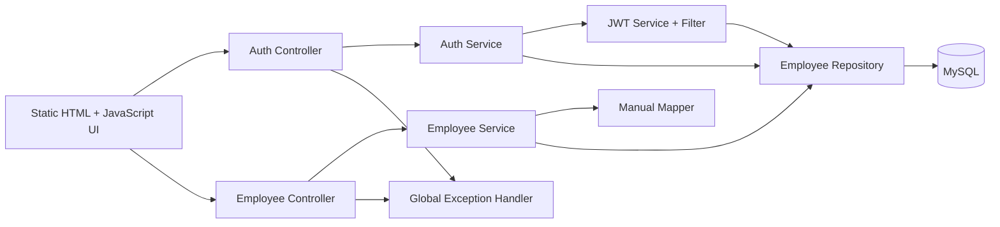

# Employee Enrollment System

Production-ready Employee Enrollment System built with Java 17, Spring Boot, Spring Security, MySQL, and a static HTML/JavaScript frontend. The project has been refactored into a feature-based vertical-slice architecture with JWT authentication, role-based authorization, global exception handling, soft delete, pagination, Swagger/OpenAPI, and unit tests.

## What Changed

- Migrated from a flat layered structure to `com.company.ems` feature modules
- Replaced Basic/session-style access with JWT bearer authentication
- Added role-based authorization for `ADMIN` and `USER`
- Standardized all API responses to `{ timestamp, status, message, data, errors }`
- Added validation-first DTOs, manual entity mappers, SLF4J logging, and profile-based YAML configuration
- Added paginated/sortable employee APIs, soft delete via `ACTIVE` / `INACTIVE`, Swagger UI, and MockMvc/Mockito tests
- Refreshed the frontend with shared JWT storage utilities, protected page guards, logout, and structured error display

## Technology Stack

- Java 17
- Spring Boot 4
- Spring Security
- Spring Data JPA / Hibernate
- MySQL
- JWT via `jjwt`
- Swagger UI via `springdoc-openapi`
- Maven
- HTML, CSS, JavaScript

## Architecture



## Package Structure

```text
src/main/java/com/company/ems
├── config
├── security
├── exception
├── common
│   ├── constants
│   ├── response
│   └── util
├── employee
│   ├── controller
│   ├── service
│   │   └── impl
│   ├── repository
│   ├── entity
│   ├── dto
│   └── mapper
├── auth
│   ├── controller
│   ├── service
│   │   └── impl
│   ├── dto
│   └── jwt
└── EmsApplication.java
```

## Core Features

- JWT token-based authentication with a custom Spring Security filter
- Role-based authorization:
  - `ADMIN`: create, list, update, deactivate employees
  - `USER`: view own profile
- DTO validation using `@NotBlank`, `@Email`, `@Size`, `@Pattern`, `@DecimalMin`, and `@PastOrPresent`
- Global exception handling for not found, duplicate, auth, and validation failures
- Paginated and sortable employee directory:
  - `GET /employees?page=0&size=10&sort=name&direction=asc`
- Soft delete with `ACTIVE` and `INACTIVE` status
- Swagger/OpenAPI documentation at `/swagger-ui.html`
- Bootstrap admin account configurable by environment
- Environment-specific configuration via `application-dev.yml` and `application-prod.yml`
- Controller and service tests using MockMvc and Mockito

## API Response Contract

```json
{
  "timestamp": "2026-03-25T10:00:00Z",
  "status": 200,
  "message": "Operation successful",
  "data": {},
  "errors": []
}
```

Validation and domain errors populate the `errors` array:

```json
{
  "timestamp": "2026-03-25T10:00:00Z",
  "status": 400,
  "message": "Validation failed",
  "data": null,
  "errors": [
    {
      "field": "phone",
      "message": "Phone number must be exactly 10 digits"
    }
  ]
}
```

## Main Endpoints

| Method | Endpoint | Access | Purpose |
|---|---|---|---|
| `POST` | `/auth/login` | Public | Authenticate and receive JWT |
| `GET` | `/auth/me` | Authenticated | Fetch current session user |
| `POST` | `/employees` | ADMIN | Create employee |
| `POST` | `/employees/enroll` | ADMIN | Backward-compatible create alias |
| `GET` | `/employees` | ADMIN | Paginated employee directory |
| `GET` | `/employees/{id}` | ADMIN | Fetch employee by id |
| `GET` | `/employees/me` | Authenticated | Fetch own profile |
| `PUT` | `/employees/{id}` | ADMIN | Update employee |
| `PATCH` | `/employees/{id}/status` | ADMIN | Update ACTIVE / INACTIVE |
| `DELETE` | `/employees/{id}` | ADMIN | Soft delete by marking inactive |

More examples are available in [docs/api-documentation.md](/Users/ADMIN/Desktop/EMS/docs/api-documentation.md).

## Configuration

Base configuration lives in:

- [application.yml](/Users/ADMIN/Desktop/EMS/src/main/resources/application.yml)
- [application-dev.yml](/Users/ADMIN/Desktop/EMS/src/main/resources/application-dev.yml)
- [application-prod.yml](/Users/ADMIN/Desktop/EMS/src/main/resources/application-prod.yml)

Key environment variables:

| Variable | Purpose |
|---|---|
| `SPRING_PROFILES_ACTIVE` | Active profile, default `dev` |
| `EMS_DB_URL` | MySQL JDBC URL |
| `EMS_DB_USERNAME` | MySQL username |
| `EMS_DB_PASSWORD` | MySQL password |
| `EMS_JWT_SECRET` | Base64 JWT signing secret |
| `EMS_JWT_ACCESS_TOKEN_EXPIRATION` | JWT lifetime, default `PT8H` |
| `EMS_BOOTSTRAP_ADMIN_ENABLED` | Enable bootstrap admin creation |
| `EMS_BOOTSTRAP_ADMIN_USERNAME` | Bootstrap admin username |
| `EMS_BOOTSTRAP_ADMIN_PASSWORD` | Bootstrap admin password |

## Default Bootstrap Admin

Development profile bootstraps a default admin account if it does not already exist:

- Username: `hr.admin`
- Password: `Admin@123`

Override these values with environment variables before running in shared or production environments.

## Local Run

1. Ensure MySQL is available.
2. Create or verify the schema using [database/employee_enrollment.sql](/Users/ADMIN/Desktop/EMS/database/employee_enrollment.sql) if you want a manual bootstrap script.
3. Set Java 17 and run Maven:

```powershell
$env:JAVA_HOME='C:\Program Files\Eclipse Adoptium\jdk-17.0.18.8-hotspot'
$env:PATH="$env:JAVA_HOME\bin;$env:PATH"
& 'C:\Users\ADMIN\Desktop\login\tools\apache-maven-3.9.12\bin\mvn.cmd' spring-boot:run
```

4. Open:

- `http://localhost:8080/login.html`
- `http://localhost:8080/swagger-ui.html`

## Test Command

```powershell
$env:JAVA_HOME='C:\Program Files\Eclipse Adoptium\jdk-17.0.18.8-hotspot'
$env:PATH="$env:JAVA_HOME\bin;$env:PATH"
& 'C:\Users\ADMIN\Desktop\login\tools\apache-maven-3.9.12\bin\mvn.cmd' test
```

## Frontend Notes

- JWT session state is stored in browser local storage through [app.js](/Users/ADMIN/Desktop/EMS/src/main/resources/static/assets/app.js)
- Protected pages use client-side role guards and all server APIs enforce authorization
- Admin UI includes pagination, sorting, status toggle, logout, and structured API error display

## Supporting Docs

- [docs/technical-documentation.md](/Users/ADMIN/Desktop/EMS/docs/technical-documentation.md)
- [docs/api-documentation.md](/Users/ADMIN/Desktop/EMS/docs/api-documentation.md)
- [docs/architecture-diagram.md](/Users/ADMIN/Desktop/EMS/docs/architecture-diagram.md)
- [docs/er-diagram.md](/Users/ADMIN/Desktop/EMS/docs/er-diagram.md)
